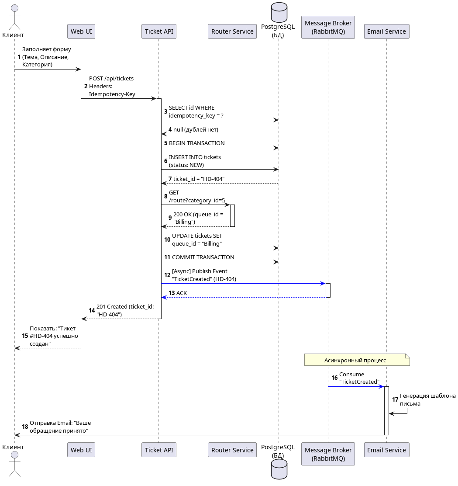
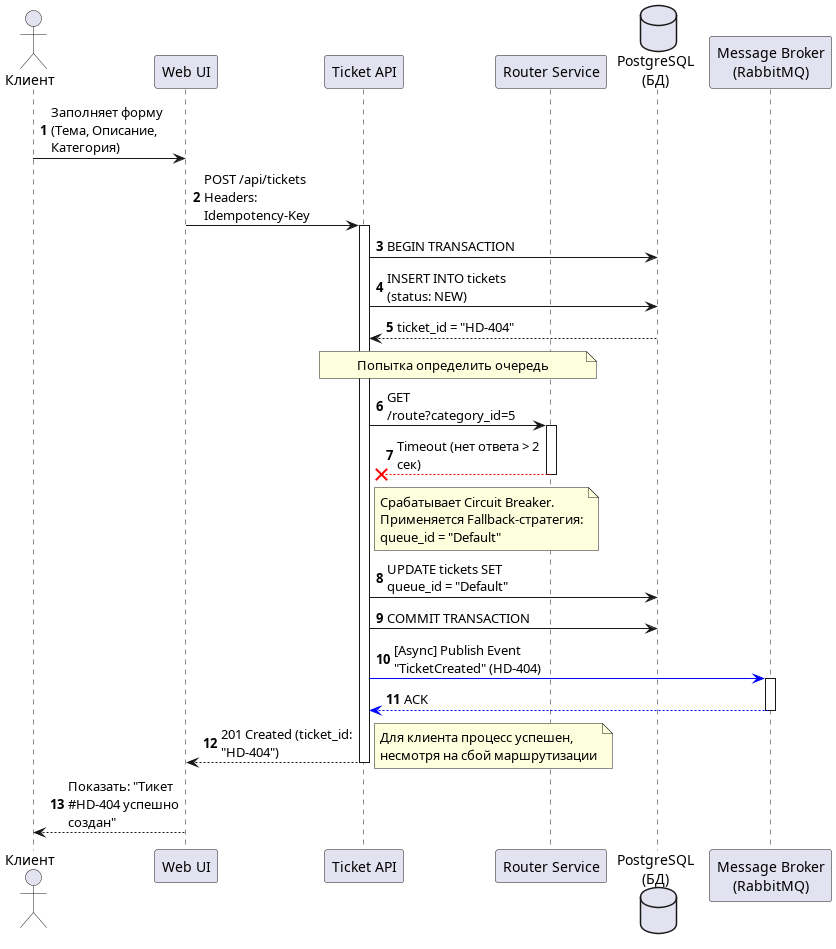

<p align="center">Министерство образования Республики Беларусь</p>
<p align="center">Учреждение образования</p>
<p align="center">"Брестский Государственный технический университет"</p>
<p align="center">Кафедра ИИТ</p>
<br><br><br><br><br><br>
<p align="center"><strong>Лабораторная работа №1</strong></p>
<p align="center"><strong>По дисциплине:</strong> "Проектирование интернет-систем"</p>
<p align="center"><strong>Тема:</strong> "Сценарий транзакции: моделирование use-case и границ ответственности"</p>
<br><br><br><br><br><br>
<p align="right"><strong>Выполнил:</strong></p>
<p align="right">Студент 3 курса</p>
<p align="right">Группы ПО-12</p>
<p align="right">Сорока И. А.</p>
<p align="right"><strong>Проверил:</strong></p>
<p align="right">Несюк А.Н.</p>
<br><br><br><br><br><br><br><br><br>
<p align="center"><strong>Брест 2026</strong></p>

---

## Цель работы

Научиться анализировать бизнес-процессы интернет-системы, выявлять границы ответственности компонентов и моделировать транзакционные сценарии с учётом возможных сбоев.

---

## Вариант №34 – HelpDesk «Поддержка на связи» 🎧

**Питч:** Решаем быстро, отвечаем вежливо.

**Ядро домена:** Тикеты, Статусы, Очереди, Исполнители, Оценки качества

---

## Ход выполнения работы

### 1. Структура проекта

```text
lab-01/
├── Отчет.md                  # Основной отчёт (этот документ)
├── use-case.md               # Текстовое описание use-case
├── diagrams/
│   ├── sequence-happy.puml   # PlantUML для успешного сценария
│   ├── sequence-happy.png    # Экспорт диаграммы
│   ├── sequence-error-routing.puml
│   └── sequence-error-routing.png
├── scenarios.feature         # Gherkin-сценарии
└── analysis.md               # Анализ границ ответственности
```

---

### 2. Use-case описание

👉 **Ссылка на файл:** [use-case.md](use-case.md)

**Основной сценарий:** Создание и маршрутизация тикета поддержки

**Первичный актор:** Клиент HelpDesk

**Цель:** Создать новое обращение, получить его номер для отслеживания и направить тикет в нужную очередь исполнителей.

**Предусловия:** 
- Клиент авторизован в системе.
- Справочник категорий проблем доступен.

**Краткое описание основного потока (Happy Path):**
1. Клиент выбирает категорию проблемы, вводит тему, описание и нажимает "Создать тикет".
2. Пользовательский web-интерфейс генерирует уникальный ключ идемпотентности и отправляет POST-запрос в Ticket API.
3. API проверяет валидность данных и отсутствие дубликатов по ключу идемпотентности.
4. API открывает транзакцию в БД и сохраняет тикет со статусом `NEW`.
5. API синхронно обращается к Сервису маршрутизации для определения очереди на основе категории.
6. API обновляет запись тикета в БД, назначая ему полученную `queue_id`, и закрывает транзакцию.
7. API ставит задачу в асинхронную очередь брокера сообщений на отправку Email-уведомления клиенту.
8. API возвращает UI статус и номер тикета.
9. UI показывает клиенту сообщение об успешном создании тикета и его номер.

**Постусловия:**
- Тикет сохранен в БД и назначен в правильную очередь.
- Задача на отправку email поставлена в очередь.

**Альтернативные потоки:**
- 2a. Дублирование запроса: Если ключ уже существует в БД:
  - 2a1. Система не создает новый тикет.
  - 2a2. Возвращает номер уже созданного ранее тикета.

**Исключительные ситуации:**
- 5a. Сервис маршрутизации недоступен:
  - 5a1. Срабатывает паттерн Circuit Breaker или Timeout.
  - 5a2. Тикет сохраняется в резервную очередь по умолчанию.
  - 5a3. Транзакция фиксируется, процесс продолжается с шага 7.
- 7a. Брокер сообщений для Email недоступен:
  - 7a1. Уведомление не отправляется.
  - 7a2. API логирует ошибку, но не откатывает создание тикета.

---

### 3. Диаграммы последовательности (Sequence Diagrams)

#### 3.1. Happy Path (успешный сценарий)

👉 **PlantUML исходник:** [sequence-happy.puml](diagrams/sequence-happy.puml)



**Описание потока:**
Идеальный сценарий, при котором клиент успешно создает тикет. Система сохраняет данные в БД, внутренний сервис маршрутизации мгновенно отвечает и назначает тикет в нужную очередь, а брокер сообщений принимает задачу на асинхронную отправку письма-уведомления.

**Участники:**
- Клиент (Актор)
- Web UI (Frontend)
- Ticket API (Backend-шлюз)
- Router Service (Микросервис маршрутизации)
- PostgreSQL (База данных)
- Message Broker (RabbitMQ)
- Email Service (Внешний сервис)

#### 3.2. Error Case (сценарий с ошибкой)

👉 **PlantUML исходник:** [sequence-error-routing.puml](diagrams/sequence-error-routing.puml)



**Описание потока:**
Моделирование отказа внутреннего микросервиса (Router Service по таймауту). Продемонстрирована работа паттернов Circuit Breaker и Fallback: вместо того чтобы возвращать клиенту ошибку, API спасает транзакцию, назначая тикету резервную очередь (Default).

---

### 4. Gherkin-сценарии

👉 **Ссылка на файл:** [scenarios.feature](scenarios.feature)

**Реализовано сценариев:** 4

**Список сценариев:**
1. ✅ **Успешный сценарий:** (Happy path: Успешное создание тикета)
2. ✅ **Ошибка:** Защита от двойного клика (Идемпотентность)
3. ✅ **Ошибка:** Ошибка маршрутизации (Fallback на общую очередь)
4. ✅ **Ошибка:** Ошибка валидации (Отсутствует описание)

**Пример сценария:**
```gherkin
Feature: Создание и распределение тикета поддержки

  Background:
    Given клиент авторизован в HelpDesk как "client@mail.com"
    And в системе существуют очереди "TechSupport" и "Billing"

  Scenario: Успешное создание тикета (Happy path)
    When клиент заполняет тему "Не проходит оплата"
    And выбирает категорию "Финансы"
    And нажимает кнопку "Создать тикет"
    Then система сохраняет тикет со статусом "NEW"
    And система определяет категорию и назначает тикет в очередь "Billing"
    And система ставит задачу на отправку email на "client@mail.com"
    And клиент видит сообщение "Тикет успешно создан. Номер вашего обращения: HD-101"
```

---

### 5. Анализ границ ответственности

👉 **Ссылка на файл:** [analysis.md](analysis.md)

#### 5.1. Транзакционные границы

| Операция | Синхронная/Асинхронная | Откат при ошибке | Retry-стратегия | Идемпотентность |
|----------|------------------------|------------------|-----------------|-----------------|
| Сохранение тикета в БД | Синхронная | Да (ROLLBACK БД транзакции) | Нет | Да (проверка `Idempotency-Key`) |
| Определение очереди (Routing) | Синхронная | Нет (Fallback на default очередь) | Circuit Breaker (без retry для клиента) | Да |
| Публикация события в Broker | Синхронная к брокеру | Да (если брокер недоступен) | Встроенный retry клиента | - |
| Отправка Email уведомления | Асинхронная | Нет (best-effort) | 3 попытки с exp. backoff, затем в DLQ | Да (дедупликация) |

#### 5.2. Обработка исключительных ситуаций

**Реализовано стратегий обработки:** 2

**Исключительная ситуация 1: Таймаут сервиса маршрутизации (Router Service)**
- **Условие возникновения:** Микросервис определения очереди не отвечает более 2 секунд.
- **Обнаружение:** HTTP-клиент (API) выбрасывает TimeoutException.
- **Реакция:** Срабатывает Circuit Breaker. Применяется Fallback-стратегия: тикету назначается queue_id = "Default". Транзакция коммитится.
- **Компенсация:** Запускается фоновый Cron-job, который позже попытается перераспределить тикеты из Default-очереди.
- **Уведомление пользователя:** Не требуется. Клиент видит сообщение об успешном создании тикета.

**Исключительная ситуация 2: Брокер сообщений недоступен**
- **Условие возникновения:** Приложение не может подключиться к RabbitMQ для публикации события TicketCreated.
- **Обнаружение:** Библиотека драйвера выбрасывает ConnectionRefused или таймаут.
- **Реакция:** Система логирует критическую ошибку (Alert).
- **Компенсация:** Возможна реализация паттерна Outbox (сохранение события в БД в рамках основной транзакции для отложенной отправки).
- **Уведомление пользователя:** Выводится сообщение "Тикет создан, но уведомление на почту может прийти с задержкой".

---

## Таблица критериев оценки

| Критерий | Баллы | Выполнено |
|----------|-------|-----------|
| Use-case описание (полнота: акторы, предусловия, основной поток, альтернативы, исключения) | 15 | ✅ |
| Sequence diagram (happy path) - корректность нотации UML, включение всех ключевых компонентов | 20 | ✅ |
| Sequence diagram (error case) - моделирование хотя бы одной исключительной ситуации | 15 | ✅ |
| Gherkin-сценарии - минимум 4 сценария (1 успешный + 3 ошибочных) | 20 | ✅ |
| Анализ границ ответственности - таблица транзакционных границ, обоснование выбора синхронных/асинхронных операций | 15 | ✅ |
| Обработка исключений - описание стратегий retry, компенсации, уведомлений | 10 | ✅ |
| Качество документации - оформление, читаемость, грамотность | 5 | ✅ |
| **ИТОГО** | **100** | |

---

## Контрольные вопросы

**Подготовка к защите:**

1. **Что такое транзакционная граница? Где она проходит в вашем сценарии?**
   Транзакционная граница определяет набор операций, которые должны выполниться атомарно (всё или ничего). В моем сценарии она начинается при получении HTTP-запроса от UI, включает проверку дублей, запрос к Router Service и запись в PostgreSQL, и закрывается (COMMIT) перед публикацией события в Message Broker.

2. **Почему операция сохранения в БД выбрана синхронной, а отправка Email - асинхронной?**
   Сохранение в БД должно быть синхронным, так как клиенту нужно моментально вернуть гарантию (ID тикета), что его обращение не потеряно. Отправка Email вынесена в асинхронный процесс, чтобы не заставлять клиента ждать ответа от медленного внешнего SMTP-сервера.

3. **Как обеспечить идемпотентность при повторных запросах?**
   На стороне UI генерируется уникальный `Idempotency-Key` (например, UUID), который передается в заголовке запроса. Перед началом транзакции API проверяет наличие этого ключа в БД. Если ключ найден, система возвращает старый результат, не создавая дубликатов.

4. **Что произойдёт, если внешний сервис вернёт ошибку после частичного выполнения операции?**
   Если ошибка критичная (например, сбой БД) — транзакция откатится (ROLLBACK). В моем сценарии (отказ Router Service) применяется механизм Fallback: ошибка проглатывается, применяются дефолтные значения (очередь Default), чтобы не блокировать основную бизнес-функцию для клиента.

5. **Как система обнаружит, что внешний сервис недоступен?**
   Через механизмы Connection Refused (сервис лежит), HTTP Timeout (сервис висит). Также используется паттерн Circuit Breaker, который при частых ошибках "размыкает" цепь и перестает слать запросы к упавшему сервису, сразу переходя к Fallback.

6. **Какие данные нужно логировать для диагностики сбоев?**
   Уникальный trace_id (для сквозного поиска по микросервисам), user_id, ticket_id, Idempotency-Key, код ответа HTTP, время отклика внешнего сервиса (latency), стек-трейс ошибки и причину сбоя (например, ReadTimeoutException).

---

## Ссылка на репозиторий

👉 **GitHub:** https://github.com/Enixfai/PIS-2026

---

## Вывод

В ходе выполнения лабораторной работы был проанализирован бизнес-процесс интернет-системы HelpDesk «Поддержка на связи». Разработано детализированное описание use-case для сценария «Создание и маршрутизация тикета поддержки», включающее в себя описание альтернативных потоков и исключительных ситуаций. С помощью инструмента PlantUML построены UML-диаграммы последовательности, визуализирующие как успешный сценарий (Happy path), так и поведение системы при отказе одного из микросервисов (паттерн Circuit Breaker).

Освоены навыки написания BDD-сценариев в нотации Gherkin для автоматизированного тестирования. Также был проведен глубокий анализ границ транзакций: обосновано разделение системы на синхронное ядро и асинхронную отправку событий в брокер сообщений, а также спроектирована защита API с помощью ключей идемпотентности (Idempotency pattern). Эти механизмы позволяют обеспечить отказоустойчивость системы при сбоях во внешних и внутренних компонентах.

---

**Дата выполнения:** 19.03.2026

**Оценка:** _____________

**Подпись преподавателя:** _____________
```