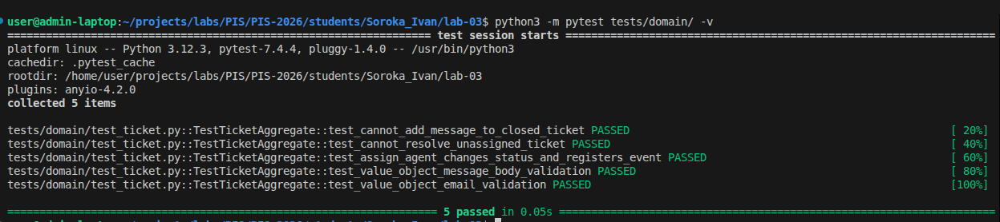

<p align="center">Министерство образования Республики Беларусь</p>
<p align="center">Учреждение образования</p>
<p align="center">"Брестский Государственный технический университет"</p>
<p align="center">Кафедра ИИТ</p>
<br><br><br><br><br><br>
<p align="center"><strong>Лабораторная работа №3</strong></p>
<p align="center"><strong>По дисциплине:</strong> "Проектирование интернет-систем"</p>
<p align="center"><strong>Тема:</strong> "Реализация Domain Layer с DDD-паттернами"</p>
<br><br><br><br><br><br>
<p align="right"><strong>Выполнил:</strong></p>
<p align="right">Студент 3 курса</p>
<p align="right">Группа ПО-12</p>
<p align="right">Сорока И. А.</p>
<p align="right"><strong>Проверил:</strong></p>
<p align="right">Шорох Д. В.</p>
<br><br><br><br><br>
<p align="center"><strong>Брест 2026</strong></p>

---

## Цель работы

Научиться применять тактические паттерны DDD (Entities, Value Objects, Aggregates, Domain Events) для реализации **доменного слоя** с инвариантами и доменной логикой.

---

## Вариант №34 - HelpDesk «Поддержка на связи» 🎧

**Питч:** Решаем быстро, отвечаем вежливо.  
**Ядро домена:** Тикеты, Статусы, Очереди, Исполнители, Оценки качества

---

## Ход выполнения работы

### 1. Value Objects (Объекты-значения)

**Созданные Value Objects:**

1. **`EmailAddress`** - Email пользователя или агента
   - Валидация: Строгая проверка формата через регулярное выражение.
   - Иммутабельность: ✅ (через `@dataclass(frozen=True)`)
   - Файл: `src/domain/value_objects.py`

2. **`MessageBody`** - Текст сообщения (комментария) внутри тикета
   - Валидация: Проверка на пустоту строки и превышение максимальной длины в 4000 символов.
   - Иммутабельность: ✅
   - Файл: `src/domain/value_objects.py`
   
3. **`Priority`** - Приоритет обращения
   - Валидация: Допустимы только значения LOW, NORMAL, HIGH, URGENT.
   - Иммутабельность: ✅

**Пример кода (MessageBody):**
```python
from dataclasses import dataclass

@dataclass(frozen=True)
class MessageBody:
    """Value Object: Текст сообщения с ограничениями"""
    text: str

    def __post_init__(self):
        if not self.text or not self.text.strip():
            raise ValueError("Сообщение не может быть пустым")
        if len(self.text) > 4000:
            raise ValueError("Превышена максимальная длина сообщения (4000 символов)")
```

**Скриншот:**


---

### 2. Entities (Сущности)

**Созданные Entity:**

1. **`Agent`** - Исполнитель (Сотрудник техподдержки)
   - ID поле: `_id`
   - Бизнес-правила: Идентифицируется только по ID. Хранит контактные данные (VO `EmailAddress`).
   - Файл: `src/domain/models/agent.py`

2. **`Message`** - Сообщение в тикете
   - ID поле: `_id`
   - Бизнес-правила: Не может существовать в отрыве от Тикета. Хранит дату создания и VO `MessageBody`.
   - Файл: `src/domain/models/message.py`

**Пример кода (Message):**
```python
from datetime import datetime
from src.domain.value_objects import MessageBody

class Message:
    """Entity: Сообщение (внутренняя сущность агрегата Ticket)"""
    def __init__(self, message_id: str, author_id: str, body: MessageBody):
        self._id = message_id
        self.author_id = author_id
        self.body = body
        self.created_at = datetime.now()

    @property
    def id(self) -> str:
        return self._id

    def __eq__(self, other):
        if not isinstance(other, Message):
            return False
        return self._id == other._id
        
    def __hash__(self):
        return hash(self._id)
```

**Скриншот тестов:**



---

### 3. Aggregate Root (Корневой агрегат)

**Aggregate Root:** `Ticket` (Тикет / Обращение клиента)

**Границы агрегата:**
- Корень: `Ticket`
- Внутренние сущности: Список объектов `Message` (Доступен только для чтения снаружи)
- Value Objects: `TicketStatus`, `Priority`

**Инварианты агрегата:**

| № | Инвариант | Как проверяется |
|---|----------|----------------|
| 1 | Нельзя добавить сообщение в закрытый тикет | В начале метода `add_message()`: `if self._status == TicketStatus.CLOSED:` |
| 2 | Нельзя назначить агента на уже решенный/закрытый тикет | В начале метода `assign_agent()`: проверка статуса на `RESOLVED` или `CLOSED` |
| 3 | Нельзя перевести тикет в статус RESOLVED без назначенного агента | В методе `resolve()`: `if not self._assigned_agent_id:` |

**Пример кода Aggregate Root (сокращенный):**
```python
from typing import List
from datetime import datetime
import uuid
from src.domain.value_objects import Priority, TicketStatus, MessageBody
from src.domain.models.message import Message
from src.domain.exceptions import InvalidTicketStateException, UnassignedTicketException
from src.domain.events import DomainEvent, TicketAssignedEvent

class Ticket:
    """Aggregate Root: Тикет (Обращение)"""
    
    def __init__(self, ticket_id: str, client_id: str, subject: str, priority: Priority):
        self._id = ticket_id
        self.client_id = client_id
        self.subject = subject
        self.priority = priority
        self._status = TicketStatus.NEW
        self._assigned_agent_id = None
        self._messages: List[Message] = []
        self._events: List[DomainEvent] =[]
        
    def add_message(self, author_id: str, text: str) -> None:
        """Инвариант: Нельзя добавлять сообщения в закрытый тикет"""
        if self._status == TicketStatus.CLOSED:
            raise InvalidTicketStateException("Нельзя добавить сообщение в закрытый тикет")
            
        body = MessageBody(text)
        message = Message(str(uuid.uuid4()), author_id, body)
        self._messages.append(message)
        self._register_event(MessageAddedEvent(self._id, message.id))
        
    def resolve(self) -> None:
        """Инвариант: Нельзя решить тикет без исполнителя"""
        if not self._assigned_agent_id:
            raise UnassignedTicketException("Нельзя перевести в RESOLVED тикет без назначенного агента")
        self._status = TicketStatus.RESOLVED
        self._register_event(TicketResolvedEvent(self._id))
```

**Скриншот тестов инвариантов:**


---

### 4. Domain Events (Доменные события)

**Созданные события:**

1. **`TicketAssignedEvent`** - Генерируется, когда метод `assign_agent()` успешно выполняется.
   - Данные: `ticket_id`, `agent_id`, `occurred_on`
   - Файл: `src/domain/events.py`

2. **`MessageAddedEvent`** - Генерируется, когда в тикет добавляется новый комментарий (`add_message()`).
   - Данные: `ticket_id`, `message_id`, `occurred_on`
   - Файл: `src/domain/events.py`

**Пример кода события:**
```python
from dataclasses import dataclass, field
from datetime import datetime
from abc import ABC

class DomainEvent(ABC):
    pass

@dataclass(frozen=True)
class TicketAssignedEvent(DomainEvent):
    ticket_id: str
    agent_id: str
    occurred_on: datetime = field(default_factory=datetime.now)
```

**Скриншот:**


---

### 5. Юнит-тесты

**Покрытие тестами:**

| Компонент | Количество тестов | Статус |
|-----------|-------------------|--------|
| Value Objects | 2 | ✅ |
| Entities | 1 | ✅ |
| Aggregate Root | 3 | ✅ |
| Domain Events | 1 | ✅ |

**Скриншот pytest:**


---

## Таблица критериев оценки

| Критерий | Баллы | Выполнено |
|----------|-------|-----------|
| Value Objects: корректная валидация, иммутабельность | 20 | ✅ |
| Entities: identity-based equality, инварианты | 20 | ✅ |
| Aggregate Root: границы, инварианты, публичные методы | 25 | ✅ |
| Domain Events: регистрация событий при изменении состояния | 15 | ✅ |
| Юнит-тесты: покрытие инвариантов, edge-cases | 15 | ✅ |
| Качество документации | 5 | ✅ |
| **ИТОГО** | **100** | |

---

## Контрольные вопросы

1. **В чём отличие Value Object от Entity?**
   - Сущность (Entity) имеет уникальную идентичность (ID). Ее свойства могут меняться со временем, но это останется тот же объект. Value Object (Объект-значение) не имеет ID, он полностью описывается своими атрибутами. Если хотя бы один атрибут меняется — это уже другой Value Object. Value Object всегда иммутабелен (неизменяем).

2. **Почему Aggregate Root должен инкапсулировать доступ к внутренним сущностям?**
   - Чтобы гарантировать соблюдение бизнес-инвариантов. Если внутренние сущности (например, список `Message` в `Ticket`) можно изменять снаружи напрямую, то сторонний код может обойти правила агрегата (например, добавить сообщение в тикет со статусом `CLOSED`), что приведет к невалидному состоянию всей бизнес-системы.

3. **Какая роль Domain Events? Приведите пример из вашей системы.**
   - Domain Events фиксируют факт успешного изменения состояния внутри домена для того, чтобы другие части системы (или внешние микросервисы) могли на это отреагировать. Пример: когда срабатывает метод `add_message()`, агрегат порождает `MessageAddedEvent`. Позже система отправки уведомлений поймает это событие и вышлет email клиенту, при этом доменный слой ничего не будет знать про email.

4. **Как вы проверяете инварианты в вашем агрегате? Приведите пример.**
   - Инварианты проверяются с помощью операторов условия (`if`) прямо в начале бизнес-метода, до изменения состояния. При нарушении выбрасывается доменное исключение (`DomainException`). Пример: в методе `resolve()` я проверяю: `if not self._assigned_agent_id: raise UnassignedTicketException(...)`.

5. **Почему Value Objects делаются иммутабельными?**
   - Это гарантирует отсутствие побочных эффектов. Поскольку Value Object определяется своими значениями (например, `EmailAddress("test@mail.com")`), его изменение приведет к путанице. Если нам нужен другой email, мы просто создаем новый объект `EmailAddress`, а не пытаемся изменить строку в старом. Это делает код потокобезопасным и легким для тестирования.

---

## Ссылка на репозиторий

👉 **GitHub:** [https://github.com/Enixfai/PIS-2026](https://github.com/Enixfai/PIS-2026)

**Структура папки:**
```text
lab-03/
├── Отчет.md
├── src/
│   └── domain/
│       ├── models/
│       │   ├── ticket.py
│       │   ├── agent.py
│       │   └── message.py
│       ├── value_objects.py
│       ├── exceptions.py
│       └── events.py
└── tests/
    └── domain/
        └── test_ticket.py
```

---

## Вывод

В ходе выполнения лабораторной работы была успешно разработана **богатая доменная модель (Rich Domain Model)** для сервиса управления тикетами. Разработан корневой агрегат `Ticket`, который строго инкапсулирует свое внутреннее состояние (список сообщений, статус) и предоставляет для изменения исключительно бизнес-методы (`add_message`, `assign_agent`, `resolve`, `close`). 

Была проведена четкая граница между сущностями, идентифицируемыми по ID (Entity), и неизменяемыми объектами-значениями (Value Objects), такими как `MessageBody` или `Priority`, валидация которых перенесена прямо в их конструкторы. Реализован механизм накопления доменных событий (`DomainEvent`) внутри агрегата для последующей публикации. Написаны модульные тесты на фреймворке `pytest`, которые подтверждают, что ни один инвариант системы нарушить невозможно (например, успешно перехвачена попытка добавить сообщение в уже закрытый тикет). Главная цель достигнута — доменный слой полностью изолирован от технических деталей базы данных и API.
