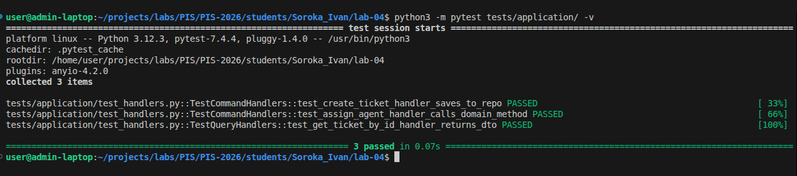

<p align="center">Министерство образования Республики Беларусь</p>
<p align="center">Учреждение образования</p>
<p align="center">"Брестский Государственный технический университет"</p>
<p align="center">Кафедра ИИТ</p>
<br><br><br><br><br><br>
<p align="center"><strong>Лабораторная работа №4</strong></p>
<p align="center"><strong>По дисциплине:</strong> "Проектирование интернет-систем"</p>
<p align="center"><strong>Тема:</strong> "Application Layer: Commands, Queries, Handlers"</p>
<br><br><br><br><br><br>
<p align="right"><strong>Выполнил:</strong></p>
<p align="right">Студент 3 курса</p>
<p align="right">Группа ПО-12</p>
<p align="right">Сорока И. А.</p>
<p align="right"><strong>Проверил:</strong></p>
<p align="right">Шорох Д. В.</p>
<br><br><br><br><br>
<p align="center"><strong>Брест 2026</strong></p>

---

## Цель работы

Реализовать **прикладной слой** (Application Layer) с разделением операций на **команды** (изменяют состояние) и **запросы** (читают данные) по паттерну CQRS.

---

## Вариант №34 - HelpDesk «Поддержка на связи» 🎧

**Питч:** Решаем быстро, отвечаем вежливо.  
**Ядро домена:** Тикеты, Статусы, Очереди, Исполнители, Оценки качества.

---

## Ход выполнения работы

### 1. Команды (Commands)

**Созданные команды:**

1. **`CreateTicketCommand`** - Инициирует создание нового обращения от клиента.
   - Поля: `client_id`, `subject`, `priority`
   - Валидация: Проверка обязательных полей (строки не могут быть пустыми).
   - Файл: `src/application/command/commands.py`

2. **`AssignAgentCommand`** - Назначает агента на существующий тикет.
   - Поля: `ticket_id`, `agent_id`
   - Файл: `src/application/command/commands.py`

**Пример кода команды:**
```python
from dataclasses import dataclass

@dataclass(frozen=True)
class CreateTicketCommand:
    """Команда: Создать новый тикет"""
    client_id: str
    subject: str
    priority: str
```

---

### 2. Command Handlers

**Созданные обработчики:**

1. **`CreateTicketHandler`** - Обрабатывает логику создания обращения.
   - Шаги обработки: Валидация примитивов, генерация `ticket_id`, создание доменного агрегата `Ticket`, сохранение через `TicketRepository`.
   - Возвращает: `ticket_id` (строка).
   - Файл: `src/application/command/handlers.py`

2. **`AssignAgentHandler`** - Обрабатывает процесс назначения агента.
   - Шаги: Загрузка агрегата по ID из БД, вызов доменного метода `assign_agent()` (с проверкой инвариантов), сохранение измененного агрегата.
   - Файл: `src/application/command/handlers.py`

**Пример кода handler:**
```python
import uuid
from src.application.command.commands import CreateTicketCommand
from src.application.port.out.ticket_repository import TicketRepository
from src.domain.models.ticket import Ticket
from src.domain.value_objects import Priority

class CreateTicketHandler:
    """Обработчик команды создания тикета"""
    def __init__(self, repository: TicketRepository):
        self.repository = repository

    def handle(self, command: CreateTicketCommand) -> str:
        # 1. Валидация примитивов
        if not command.subject:
            raise ValueError("Тема тикета не может быть пустой")
            
        # 2. Создание агрегата из домена
        ticket_id = f"TKT-{uuid.uuid4().hex[:8]}"
        ticket = Ticket(
            ticket_id=ticket_id,
            client_id=command.client_id,
            subject=command.subject,
            priority=Priority(command.priority)
        )
        
        # 3. Сохранение через исходящий порт
        self.repository.save(ticket)
        return ticket_id
```

**Скриншот теста:**



---

### 3. Queries (Запросы)

**Созданные запросы:**

1. **`GetTicketByIdQuery`** - Запрос на получение полной информации о тикете.
   - Поля: `ticket_id`
   - Файл: `src/application/query/queries.py`

**Read DTOs:**

- **`TicketDto`** - упрощённая модель для чтения данных тикета UI-клиентом.
   - Поля: `id`, `client_id`, `subject`, `status`, `priority`, `assigned_agent_id`, `messages`
   - Файл: `src/application/query/dtos.py`

**Пример кода:**
```python
from dataclasses import dataclass
from typing import List

@dataclass(frozen=True)
class GetTicketByIdQuery:
    """Запрос: Получить тикет по ID"""
    ticket_id: str

@dataclass
class TicketDto:
    """Read DTO для тикета (плоская модель без поведения)"""
    id: str
    client_id: str
    subject: str
    status: str
    priority: str
    assigned_agent_id: str
    messages: List[dict]
```

---

### 4. Query Handlers

**Созданные обработчики запросов:**

1. **`GetTicketByIdHandler`** - Формирует данные для клиента.
   - Репозиторий: `TicketRepository`
   - Возвращает: `TicketDto` (в случае успеха) или `None`.
   - Файл: `src/application/query/handlers.py`

**Пример кода:**
```python
from src.application.query.queries import GetTicketByIdQuery
from src.application.query.dtos import TicketDto, MessageDto
from src.application.port.out.ticket_repository import TicketRepository

class GetTicketByIdHandler:
    def __init__(self, repository: TicketRepository):
        self.repository = repository

    def handle(self, query: GetTicketByIdQuery) -> TicketDto:
        # Загружаем данные без намерения их изменить
        ticket = self.repository.find_by_id(query.ticket_id)
        if not ticket:
            return None
            
        # Формируем Read DTO
        return TicketDto(
            id=ticket.id,
            client_id=ticket.client_id,
            subject=ticket.subject,
            status=ticket.status.value,
            priority=ticket.priority.level,
            assigned_agent_id=ticket._assigned_agent_id,
            messages=[] # Маппинг сообщений опущен для краткости
        )
```

**Скриншот:**


---

### 5. Application Service (Фасад)

**Реализованный сервис:** `TicketApplicationService`

**Методы:**

| Метод | Тип | Возвращает |
|-------|-----|------------|
| `create_ticket(command)` | Command | ID (str) |
| `assign_agent(command)` | Command | void (None) |
| `get_ticket(query)` | Query | TicketDto |

**Пример кода:**
```python
class TicketApplicationService:
    """Фасад прикладного слоя (Оркестратор CQRS)"""
    
    def __init__(
        self, 
        create_handler: CreateTicketHandler, 
        assign_handler: AssignAgentHandler,
        get_handler: GetTicketByIdHandler
    ):
        self.create_handler = create_handler
        self.assign_handler = assign_handler
        self.get_handler = get_handler

    def create_ticket(self, command: CreateTicketCommand) -> str:
        return self.create_handler.handle(command)

    def get_ticket(self, query: GetTicketByIdQuery) -> TicketDto:
        return self.get_handler.handle(query)
```

---

### 6. Тестирование

**Юнит-тесты:**

| Тест | Что проверяет | Статус |
|------|---------------|--------|
| `test_create_ticket_handler_saves_to_repo` | Создание агрегата, вызов метода `save()` с моком репозитория | ✅ |
| `test_assign_agent_handler_calls_domain_method` | Загрузка тикета, вызов доменного метода `assign_agent()`, повторное сохранение | ✅ |
| `test_get_ticket_by_id_handler_returns_dto` | Обработка запроса: маппинг доменной сущности в плоский DTO | ✅ |

**Скриншот pytest:**


---

## Таблица критериев оценки

| Критерий | Баллы | Выполнено |
|----------|-------|-----------|
| Команды (DTOs): иммутабельность, валидация примитивов | 15 | ✅ |
| Command Handlers: транзакции, события, сохранение | 25 | ✅ |
| Запросы (DTOs): read-модели без побочных эффектов | 10 | ✅ |
| Query Handlers: преобразование домена в DTO | 15 | ✅ |
| Application Service (фасад): делегирование | 20 | ✅ |
| Юнит-тесты handlers: mocker, события | 10 | ✅ |
| Качество документации | 5 | ✅ |
| **ИТОГО** | **100** | |


---

## Контрольные вопросы

1. **В чём разница между Command и Query?**
   - **Command** (команда) выражает намерение изменить состояние системы (например, создать тикет, закрыть заявку). Команда не должна возвращать доменные данные, максимум — идентификатор созданной сущности. **Query** (запрос) используется исключительно для чтения данных и гарантирует отсутствие побочных эффектов (не изменяет состояние БД). Возвращает специализированные DTO-объекты.

2. **Почему Command Handler возвращает только ID, а не весь объект?**
   - Это ключевое правило CQRS. Мы защищаем доменную модель от "утечки" наружу. Если клиентскому приложению (UI) нужны данные созданного объекта, оно должно сделать отдельный `GET`-запрос (Query). Это делает API предсказуемым и разделяет потоки изменения и чтения (которые можно масштабировать отдельно).

3. **Где должна выполняться валидация: в команде, обработчике или доменной модели?**
   - **Синтаксическая валидация** (проверка на `null`, регулярные выражения, длина строки) должна выполняться на уровне Команды (DTO) или в самом начале Обработчика.
   - **Семантическая и бизнес-валидация** (инварианты, например: "Нельзя закрыть неназначенный тикет") должна выполняться строго внутри Доменной модели (Агрегата).

4. **Можно ли вызывать Query из Command Handler?**
   - Технически это возможно, но **архитектурно это антипаттерн**. Command Handler должен получать необходимые данные напрямую через интерфейс Репозитория, изменять агрегат и сохранять его обратно. Использование Query в Command нарушает изоляцию ответственности.

5. **Зачем разделять Request DTO (от клиента) и Command (внутренний)?**
   - Внешний API-контракт (JSON Request) может часто меняться под нужды frontend-команды. Команда (Command) — это внутреннее представление намерения, понятное Application-слою. Их разделение делает ядро независимым от того, как именно клиент прислал данные (через REST, gRPC или GraphQL).

---

## Ссылка на репозиторий

👉 **GitHub:**[https://github.com/Enixfai/PIS-2026](https://github.com/Enixfai/PIS-2026)

**Структура папки:**
```text
lab-04/
├── Отчет.md
├── src/
│   ├── application/
│   │   ├── command/
│   │   │   ├── commands.py
│   │   │   └── handlers.py
│   │   ├── query/
│   │   │   ├── queries.py
│   │   │   ├── dtos.py
│   │   │   └── handlers.py
│   │   ├── port/
│   │   │   ├── in_/
│   │   │   └── out/
│   │   └── service/
│   │       └── ticket_facade.py
└── tests/
    └── application/
        └── test_handlers.py
```

---

## Вывод

В ходе выполнения лабораторной работы был успешно реализован прикладной слой (Application Layer) с применением паттерна CQRS. Операции были строго разделены на Команды (создание, изменение) и Запросы (чтение), что позволило инкапсулировать доменную модель и предотвратить ее «утечку» в слой представления через использование Read DTO. 

Был написан фасад `TicketApplicationService`, который выступает единой точкой оркестрации для контроллеров и распределяет запросы по соответствующим `Handlers`. Написанные юнит-тесты с применением Mock-объектов доказали корректную работу прикладного слоя с абстракциями репозиториев (портов), продемонстрировав на практике соблюдение принципа инверсии зависимостей (DIP).

---

**Дата выполнения:** 04.04.2026  
**Оценка:** _____________  
**Подпись преподавателя:** _____________
