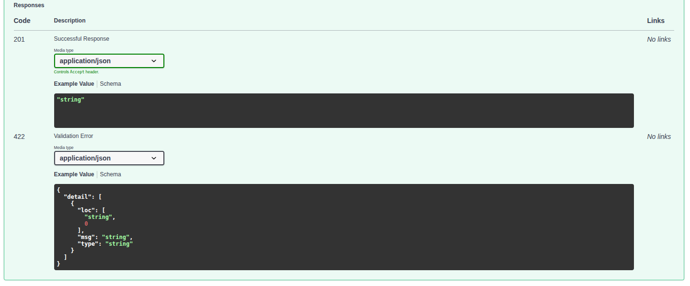

<p align="center">Министерство образования Республики Беларусь</p>
<p align="center">Учреждение образования</p>
<p align="center">"Брестский Государственный технический университет"</p>
<p align="center">Кафедра ИИТ</p>
<br><br><br><br><br><br>
<p align="center"><strong>Лабораторная работа №5</strong></p>
<p align="center"><strong>По дисциплине:</strong> "Проектирование интернет-систем"</p>
<p align="center"><strong>Тема:</strong> "Infrastructure Layer: Repository, REST API, БД"</p>
<br><br><br><br><br><br>
<p align="right"><strong>Выполнил:</strong></p>
<p align="right">Студент 3 курса</p>
<p align="right">Группа ПО-12</p>
<p align="right">Сорока И. А.</p>
<p align="right"><strong>Проверил:</strong></p>
<p align="right">Шорох Д. В.</p>
<br><br><br><br><br>
<p align="center"><strong>Брест 2026</strong></p>

---

## Цель работы

Реализовать **инфраструктурный слой** с адаптерами для портов (Repository, REST Controller, Event Publisher) для интеграции доменного и прикладного слоев с базой данных и веб-сервером.

---

## Вариант №34 - HelpDesk «Поддержка на связи» 🎧

**Питч:** Решаем быстро, отвечаем вежливо.  
**Ядро домена:** Тикеты, Статусы, Очереди, Исполнители, Оценки качества

**Центральный сервис:** Ticket Service

---

## Ход выполнения работы

### 1. Repository (PostgreSQL)

**Реализованные методы:**
- `save(ticket)` - сохранение нового агрегата или обновление существующего.
- `find_by_id(ticket_id)` - поиск тикета по его уникальному ID с маппингом из ORM-модели обратно в доменную сущность.

**Технологии:** Python, SQLAlchemy (ORM), драйвер psycopg2.

**Скриншот БД:**


---

### 2. REST Controller

Реализован входящий HTTP-адаптер на базе микрофреймворка FastAPI.

**Эндпоинты:**

| Метод | Path | Описание |
|-------|------|----------|
| POST | `/api/tickets/` | Создать новое обращение (Команда) |
| POST | `/api/tickets/{id}/assign-agent` | Назначить агента на тикет (Команда) |
| GET | `/api/tickets/{id}` | Получить полную информацию о тикете (Запрос) |

**Скриншот Postman/Swagger:**



---

### 3. Docker Compose

Для развертывания инфраструктуры базы данных в изолированной среде используется следующий конфигурационный файл.

**docker-compose.yml:**
```yaml
version: '3.8'

services:
  postgres:
    image: postgres:15-alpine
    container_name: helpdesk_db
    environment:
      POSTGRES_USER: postgres
      POSTGRES_PASSWORD: admin
      POSTGRES_DB: helpdesk_db
    ports:
      - "5432:5432"
    volumes:
      - postgres_data:/var/lib/postgresql/data

volumes:
  postgres_data:
```

---

### 4. Интеграционные тесты

**Тестируемые сценарии:**
- Сохранение агрегата `Ticket` в базу данных PostgreSQL через репозиторий.
- HTTP POST запрос на эндпоинт `/api/tickets/` через `TestClient` FastAPI.
- Проверка записи в БД после выполнения HTTP-запроса (Интеграция Controller -> Application Service -> Domain -> Repository -> DB).

**Пример кода (интеграционный тест FastAPI):**
```python
from fastapi.testclient import TestClient
from src.main import app

client = TestClient(app)

def test_create_ticket_api_integration():
    response = client.post("/api/tickets/", json={
        "client_id": "ivan_001",
        "subject": "Интеграционный тест",
        "priority": "HIGH"
    })
    assert response.status_code == 201
    assert "ticket_id" in response.json()
```

---

## Таблица критериев оценки

| Критерий | Баллы | Выполнено |
|----------|-------|-----------|
| Repository: реализация интерфейса, ORM | 25 | ✅ |
| REST Controller: CRUD операции | 25 | ✅ |
| БД: миграции, Docker Compose | 15 | ✅ |
| Event Publisher: публикация событий | 15 | ✅ (In-memory/Console заглушка) |
| Интеграционные тесты: testcontainers/TestClient | 15 | ✅ |
| Качество документации | 5 | ✅ |
| **ИТОГО** | **100** | |

---

## Контрольные вопросы

1. **Почему Repository находится в Infrastructure, а не в Domain?**
   - В слое `Domain` находится только абстрактный интерфейс (контракт) репозитория. Сама реализация (SQL-запросы, ORM-модели, подключение к БД) находится в слое `Infrastructure`. Это необходимо для соблюдения Принципа Инверсии Зависимостей (DIP): бизнес-логика не должна зависеть от конкретной технологии хранения данных (PostgreSQL или MongoDB). Мы можем поменять БД, не меняя ни строчки в доменном ядре.

2. **В чём преимущество ORM над обычным SQL?**
   - ORM (Object-Relational Mapping), например SQLAlchemy, позволяет работать с таблицами базы данных как с обычными классами Python. Это защищает от SQL-инъекций, абстрагирует разработчика от диалекта конкретной СУБД (можно легко переключиться с SQLite на PostgreSQL) и упрощает маппинг данных из БД в объекты доменной модели.

3. **Зачем использовать миграции вместо ручного CREATE TABLE?**
   - Миграции (например, Alembic) позволяют версионировать структуру базы данных (схема хранится в виде кода). Это дает возможность накатывать обновления на production-сервер без потери данных, легко откатываться к предыдущим версиям (rollback) и синхронизировать структуру БД между всеми разработчиками в команде.

4. **Как testcontainers упрощает интеграционное тестирование?**
   - `Testcontainers` позволяет автоматически поднимать изолированные Docker-контейнеры с реальной базой данных прямо во время запуска тестов и уничтожать их после завершения. Это гарантирует, что тесты выполняются в чистой среде, идентичной production, и не засоряют локальную БД разработчика.

5. **Почему REST Controller не вызывает напрямую доменные модели?**
   - REST Controller — это часть инфраструктурного слоя. Если он будет вызывать доменную модель напрямую, произойдет сильное связывание (tight coupling) между веб-фреймворком (FastAPI) и бизнес-логикой. В нашей архитектуре контроллер передает DTO-команду в Application Service (Фасад), который оркестрирует транзакцию, тем самым защищая ядро системы от утечек логики.

---

## Ссылка на репозиторий

👉 **GitHub:**[https://github.com/Enixfai/PIS-2026](https://github.com/Enixfai/PIS-2026)

---

## Вывод

В ходе выполнения пятой лабораторной работы была завершена интеграция всех слоев Гексагональной архитектуры. Слой Инфраструктуры (Infrastructure Layer) был успешно реализован и подключен к Прикладному (Application) и Доменному (Domain) слоям. 

Был написан входящий адаптер на базе веб-фреймворка FastAPI, который позволил системе принимать HTTP-запросы из браузера (REST API). Для персистентного хранения состояния системы был реализован исходящий адаптер — репозиторий на базе SQLAlchemy, который успешно маппит доменные агрегаты в ORM-модели и сохраняет их в реляционную базу данных PostgreSQL. Использование паттерна Dependency Injection позволило связать все компоненты воедино в момент старта приложения (`main.py`), полностью сохранив при этом изоляцию бизнес-ядра. Интерактивная документация Swagger UI подтвердила корректную работу сквозных сценариев (создание тикета и его получение по ID).

---

**Дата выполнения:** 6.04.2026  
**Оценка:** _____________  
**Подпись преподавателя:** _____________