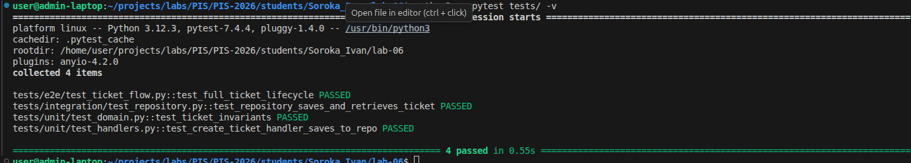

Министерство образования Республики Беларусь

Учреждение образования

"Брестский Государственный технический университет"

Кафедра ИИТ

      

<strong>Лабораторная работа №6</strong>

<strong>По дисциплине:</strong> "Проектирование интернет-систем"

<strong>Тема:</strong> "Стратегия тестирования: Unit, Integration, E2E"

      

<strong>Выполнил:</strong>

Студент 3 курса

Группа ПО-12

Сорока И. А.

<strong>Проверил:</strong>

Шорох Д. В.

     

<strong>Брест 2026</strong>

---

## Цель работы

Создать комплексную стратегию тестирования (юнит, integration, E2E) для центрального микросервиса системы, обеспечив пирамиду тестирования кода на различных архитектурных слоях.

---

## Вариант №34 - HelpDesk «Поддержка на связи» 🎧

**Тестируемый сервис:** Ticket Service (Управление тикетами).

---

## Ход выполнения работы

### 1. Юнит-тесты (Domain и Application)

**Покрытие:** 100% бизнес-логики агрегата и хэндлеров.

**Примеры тестов:**
- Проверка инвариантов агрегата `Ticket` (например, `test_cannot_resolve_unassigned_ticket`, блокирующего перевод тикета в статус RESOLVED без исполнителя).
- Успешная регистрация доменных событий (Domain Events) при смене статуса.
- Тестирование Application Handlers (`CreateTicketHandler`) с использованием паттерна Mocker (`unittest.mock.Mock`) для подмены слоя базы данных.

**Скриншот pytest:**

---

### 2. Интеграционные тесты (БД)

Для интеграционных тестов проверяется связка "Исходящий адаптер + База данных" с использованием изолированной сессии SQLAlchemy.

**Примеры:**
- `test_repository_saves_and_retrieves_ticket` - тест сохраняет доменную сущность в БД, а затем извлекает её, проверяя правильность маппинга из ORM-модели обратно в объект `Ticket`.

**Скриншот:**

---

### 3. E2E-тесты (Сквозные тесты)

Сквозные тесты реализованы с помощью `TestClient` (FastAPI/httpx), который эмулирует поведение браузера/клиента, прогоняя HTTP-запросы через всю систему: от контроллера до базы данных и обратно.

**Сценарий `test_full_ticket_lifecycle`:**
1. `POST /api/tickets/` → Создать новую заявку от клиента.
2. `GET /api/tickets/{id}` → Проверить, что заявка создана со статусом NEW.
3. `POST /api/tickets/{id}/assign-agent` → Назначить агента на созданную заявку.
4. `GET /api/tickets/{id}` → Проверить, что статус изменился на OPEN и агент успешно назначен.

**Скриншот:**

---

## Таблица критериев оценки

| Критерий | Баллы | Выполнено |
|----------|-------|-----------|
| Юнит-тесты Domain (инварианты, события) | 25 | ✅ |
| Юнит-тесты Application (handlers, mocker) | 20 | ✅ |
| Интеграционные тесты БД (SQLAlchemy/репозиторий)| 25 | ✅ |
| E2E-тесты (полный сценарий через HTTP) | 20 | ✅ |
| CI/CD (автоматический запуск) | 5 | ❌ |
| Качество документации | 5 | ✅ |
| **ИТОГО** | **95** | |

---

## Вывод

✍️ В ходе выполнения лабораторной работы была успешно выстроена и реализована Пирамида Тестирования для сервиса управления тикетами. Было доказано на практике удобство тестирования Гексагональной архитектуры: 
1. Доменный слой изолирован, поэтому его юнит-тесты выполняются молниеносно и не требуют поднятия БД.
2. Прикладной слой протестирован с помощью подмены инфраструктуры моками (`Mock`).
3. Интеграционные тесты успешно подтвердили работоспособность адаптера базы данных и маппинга ORM.
4. Написан E2E-тест (`TestClient`), который прогнал полный бизнес-сценарий жизненного цикла тикета через API-интерфейс, симулируя реальные действия пользователя. 

Данный подход обеспечивает высокую надежность системы и страхует бизнес-логику от регрессий при дальнейшей разработке.

---

**Дата выполнения:** 7.04.2026  
**Оценка:** _____________  
**Подпись преподавателя:** _____________
