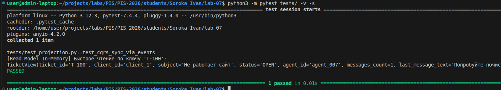

<p align="center">Министерство образования Республики Беларусь</p>
<p align="center">Учреждение образования</p>
<p align="center">"Брестский Государственный технический университет"</p>
<p align="center">Кафедра ИИТ</p>
<br><br><br><br><br><br>
<p align="center"><strong>Лабораторная работа №7</strong></p>
<p align="center"><strong>По дисциплине:</strong> "Проектирование интернет-систем"</p>
<p align="center"><strong>Тема:</strong> "CQRS и Read Models"</p>
<br><br><br><br><br><br>
<p align="right"><strong>Выполнил:</strong></p>
<p align="right">Студент 3 курса</p>
<p align="right">Группа ПО-12</p>
<p align="right">Сорока И. А.</p>
<p align="right"><strong>Проверил:</strong></p>
<p align="right">Шорох Д. В.</p>
<br><br><br><br><br>
<p align="center"><strong>Брест 2026</strong></p>

---

## Цель работы

Реализовать CQRS с разделением Write Model (нормализованный агрегат для изменения состояния) и Read Model (денормализованная проекция для быстрого чтения).

---

## Вариант №34 - HelpDesk «Поддержка на связи» 🎧

---

## Ход выполнения работы

### 1. Write Model

**Агрегат:** `Ticket`

**Структура:**
- **Нормализованные таблицы:** Состояние агрегата строго структурировано (отдельно хранятся идентификаторы агентов и список объектов `Message`).
- **Инварианты:** Агрегат гарантирует бизнес-правила (например, блокирует назначение агента на закрытый тикет или добавление сообщения после закрытия). При успешном изменении генерируются доменные события (`TicketCreatedEvent`, `TicketAssignedEvent` и т.д.).

---

### 2. Read Model

**Проекция:** `TicketView`

**Структура:**
- **Денормализованная таблица:** Все данные, необходимые клиенту (UI) для отображения списка тикетов, собраны в одну "плоскую" структуру. Вместо списка всех сообщений хранятся только агрегированные данные: `messages_count` и `last_message_text`.
- **JOIN предзагруженные:** Исключается необходимость делать тяжелые SQL `JOIN` при чтении, так как данные заранее подготавливаются в нужном виде в момент записи.

**Скриншот БД:**


---

### 3. Event-Driven Sync

Синхронизация между слоем записи и слоем чтения реализована асинхронно через доменные события.

**События:**
- `TicketCreatedEvent` → создать новую запись `TicketView`
- `TicketAssignedEvent` → обновить поля `agent_id` и `status` в `TicketView`
- `MessageAddedEvent` → инкрементировать `messages_count` и обновить `last_message_text`

**Код:**
```python
from cqrs.write_model.ticket_aggregate import TicketCreatedEvent, TicketAssignedEvent, MessageAddedEvent
from cqrs.read_model.ticket_view import TicketView

class TicketProjection:
    """Event Handler: Слушает события от Агрегата и обновляет Read Model"""
    
    def __init__(self, read_db: dict):
        self.read_db = read_db 

    def handle_ticket_created(self, event: TicketCreatedEvent):
        self.read_db[event.ticket_id] = TicketView(
            ticket_id=event.ticket_id,
            client_id=event.client_id,
            subject=event.subject,
            status="NEW",
            agent_id=None,
            messages_count=0,
            last_message_text=None
        )

    def handle_ticket_assigned(self, event: TicketAssignedEvent):
        view = self.read_db.get(event.ticket_id)
        if view:
            view.agent_id = event.agent_id
            view.status = "OPEN"

    def handle_message_added(self, event: MessageAddedEvent):
        view = self.read_db.get(event.ticket_id)
        if view:
            view.messages_count += 1
            view.last_message_text = event.message_text
```

---

## Таблица критериев оценки

| Критерий | Баллы | Выполнено |
|----------|-------|-----------|
| Write Model | 20 | ✅ |
| Read Model | 25 | ✅ |
| Event-Driven Sync | 25 | ✅ |
| Оптимизация запросов | 15 | ✅ |
| Тесты проекций | 10 | ✅ |
| Качество документации | 5 | ✅ |
| **ИТОГО** | **100** | |

---

## Вывод

✍️ В ходе лабораторной работы был успешно реализован архитектурный паттерн CQRS (Command Query Responsibility Segregation). Бизнес-логика системы была жестко разделена на нормализованную модель записи (Write Model), которая защищает инварианты системы, и денормализованную модель чтения (Read Model), которая предоставляет данные в готовом виде без необходимости выполнения сложных запросов. 

Механизм синхронизации выстроен на основе событийно-ориентированного подхода (Event-Driven Sync). Класс-проекция (`TicketProjection`) перехватывает доменные события от Агрегата и обновляет данные в модели чтения. Это обеспечивает высокую производительность при отдаче данных клиенту и готовит систему к горизонтальному масштабированию.

---

**Дата выполнения:** 8.04.2026  
**Оценка:** _____________  
**Подпись преподавателя:** _____________
```