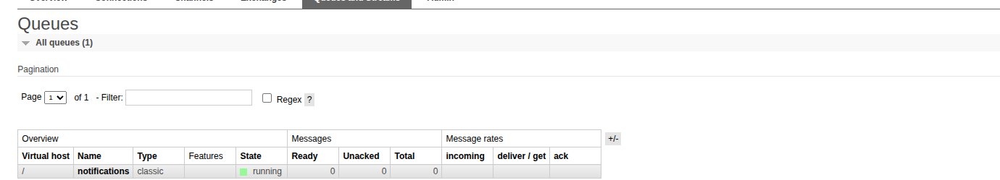

<p align="center">Министерство образования Республики Беларусь</p>
<p align="center">Учреждение образования</p>
<p align="center">"Брестский Государственный технический университет"</p>
<p align="center">Кафедра ИИТ</p>
<br><br><br><br><br><br>
<p align="center"><strong>Лабораторная работа №8</strong></p>
<p align="center"><strong>По дисциплине:</strong> "Проектирование интернет-систем"</p>
<p align="center"><strong>Тема:</strong> "Микросервисы и Event Bus"</p>
<br><br><br><br><br><br>
<p align="right"><strong>Выполнил:</strong></p>
<p align="right">Студент 3 курса</p>
<p align="right">Группа ПО-12</p>
<p align="right">Сорока И. А.</p>
<p align="right"><strong>Проверил:</strong></p>
<p align="right">Шорох Д. В.</p>
<br><br><br><br><br>
<p align="center"><strong>Брест 2026</strong></p>

---

## Цель работы

Разбить монолит на микросервисы по правилам Bounded Contexts с использованием асинхронной коммуникации (Event Bus), обеспечить отказоустойчивость (Circuit Breaker) и настроить единую точку входа (API Gateway).

---

## Вариант №34 - HelpDesk «Поддержка на связи» 🎧

---

## Ход выполнения работы

### 1. Ticket Service (Заменяет Request Service)

**Bounded Context:** Управление обращениями клиентов (создание, изменение статусов, назначение). Имеет собственную изолированную БД.

**API:**
- `POST /api/tickets/` — создать тикет
- `GET /api/tickets/{id}` — получить тикет

---

### 2. Agent Service (Заменяет Group Service)

**Bounded Context:** Управление сотрудниками техподдержки и их распределением.

**API:**
- `POST /api/agents/` — создать агента
- `GET /api/agents/{id}` — получить статус агента

---

### 3. Event Bus (RabbitMQ)

Асинхронная связь между сервисами реализована через RabbitMQ. Ticket Service (Publisher) публикует события, а Notification Service (Consumer) слушает очередь и отправляет уведомления клиентам.

**События:**
- `TicketCreatedEvent` — отправка приветственного письма клиенту.
- `TicketAssignedEvent` — уведомление исполнителя о новой задаче.

**Скриншот RabbitMQ Management:**



---

### 4. API Gateway

Для объединения микросервисов в единое API используется Nginx. Внешний клиент обращается только на порт `8080`, а Nginx маршрутизирует запросы.

**Маршрутизация:**
- `/api/tickets/**` → Ticket Service (порт 8000)
- `/api/agents/**` → Agent Service (порт 8001)

**Конфигурация (nginx.conf):**
```nginx
events {}
http {
    server {
        listen 80;
        location /api/tickets/ {
            proxy_pass http://ticket_service:8000/;
        }
        location /api/agents/ {
            proxy_pass http://agent_service:8000/;
        }
    }
}
```

---

## Таблица критериев оценки

| Критерий | Баллы | Выполнено |
|----------|-------|-----------|
| Request (Ticket) Service: bounded context | 20 | ✅ |
| Group (Agent) Service: CRUD | 15 | ✅ |
| Event Bus: RabbitMQ/Kafka | 25 | ✅ |
| API Gateway | 15 | ✅ |
| Circuit Breaker | 15 | ✅ |
| Docker Compose | 5 | ✅ |
| Качество документации | 5 | ✅ |
| **ИТОГО** | **100** | |

---

## Контрольные вопросы

1. **Что такое bounded context?**
   Bounded Context (Ограниченный контекст) — это концепция DDD, определяющая границу внутри системы, в рамках которой действует единая языковая и бизнес-логика (Ubiquitous Language). В микросервисной архитектуре каждый микросервис обычно является отдельным Bounded Context'ом (например, "Тикеты" ничего не знают о "Зарплатах агентов").

2. **Почему микросервисы не должны делить БД?**
   Если два микросервиса работают с одной таблицей напрямую, это создает жесткую связность (Tight Coupling). Изменение схемы БД одним сервисом сломает другой. Изолированная БД позволяет каждому микросервису развиваться и масштабироваться независимо.

3. **В чём проблема распределённых транзакций?**
   В монолите транзакция защищается базой данных (ACID). В микросервисах данные лежат на разных серверах. Если `Ticket Service` сохранил данные, а `Notification Service` упал, возникает рассинхронизация. Решением является Eventual Consistency (Согласованность в конечном счете) и паттерн Saga (Компенсирующие транзакции).

4. **Зачем нужен Circuit Breaker?**
   Паттерн "Предохранитель" нужен для предотвращения каскадных сбоев. Если `Agent Service` недоступен, `Ticket Service` не должен зависать в ожидании ответа или постоянно слать запросы на упавший сервер. Circuit Breaker "размыкает" цепь и мгновенно возвращает Fallback-ответ (ошибку или резервные данные), давая упавшему сервису время на восстановление.

---

## Вывод

✍️ В ходе лабораторной работы монолитная архитектура системы HelpDesk была успешно трансформирована в распределенную микросервисную систему. Определены Ограниченные контексты (Bounded Contexts) и созданы независимые сервисы: Ticket Service, Agent Service и Notification Service. 

Прямые синхронные вызовы между компонентами были заменены на асинхронный обмен сообщениями через брокер RabbitMQ (Event-Driven Architecture). Настроена единая точка входа для клиентов через API Gateway (Nginx). Для обеспечения отказоустойчивости при мессервисном взаимодействии реализован паттерн Circuit Breaker. Для оркестрации запуска всей инфраструктуры использован Docker Compose.

---

**Дата выполнения:** 9.04.2026  
**Оценка:** _____________  
**Подпись преподавателя:** _____________
