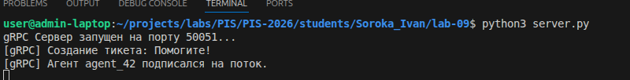
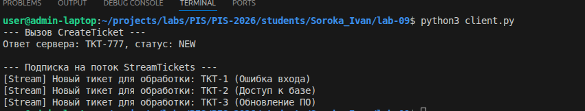

<p align="center">Министерство образования Республики Беларусь</p>
<p align="center">Учреждение образования</p>
<p align="center">"Брестский Государственный технический университет"</p>
<p align="center">Кафедра ИИТ</p>
<br><br><br><br><br><br>
<p align="center"><strong>Лабораторная работа №9</strong></p>
<p align="center"><strong>По дисциплине:</strong> "Проектирование интернет-систем"</p>
<p align="center"><strong>Тема:</strong> "Protocol Buffers и gRPC"</p>
<br><br><br><br><br><br>
<p align="right"><strong>Выполнил:</strong></p>
<p align="right">Студент 3 курса</p>
<p align="right">Группа ПО-12</p>
<p align="right">Сорока И. А.</p>
<p align="right"><strong>Проверил:</strong></p>
<p align="right">Шорох Д. В.</p>
<br><br><br><br><br>
<p align="center"><strong>Брест 2026</strong></p>

---

## Цель работы
Заменить стандартную REST-коммуникацию на высокопроизводительный протокол gRPC для взаимодействия между микросервисами, освоить описание интерфейсов через Protocol Buffers и реализовать серверный стриминг.

---

## Вариант №34 - HelpDesk «Поддержка на связи» 🎧

---

## Ход выполнения работы

### 1. Протофайлы (.proto)

Интерфейс сервиса описан в файле `ticket.proto`. Использование бинарного формата Protocol Buffers позволяет жестко типизировать сообщения и автоматически генерировать код клиента/сервера.

**ticket.proto:**
```protobuf
syntax = "proto3";

package ticket;

service TicketService {
  rpc CreateTicket(CreateTicketRequest) returns (TicketResponse);
  rpc GetTicket(GetTicketRequest) returns (TicketResponse);
  rpc StreamTickets(StreamRequest) returns (stream TicketResponse);
}

message CreateTicketRequest {
  string client_id = 1;
  string subject = 2;
  string priority = 3;
}

message TicketResponse {
  string ticket_id = 1;
  string status = 2;
  string subject = 3;
}
```

---

### 2. gRPC Server

Сервер реализует методы, описанные в контракте. Для управления конкурентными запросами использован `ThreadPoolExecutor`.

**Методы:**
- `CreateTicket`: Принимает данные тикета и возвращает объект ответа (Unary).
- `StreamTickets`: Реализует **Server-side streaming**, передавая поток новых тикетов клиенту (агенту) по мере их появления.

---

### 3. gRPC Client

**Скриншот вызова RPC:**



---

### 4. Server-Side Streaming

Реализован сценарий, при котором агент подписывается на входящие тикеты. Сервер удерживает HTTP/2 соединение открытым и "проталкивает" (push) новые сообщения клиенту.

**Скриншот потока:**



---

## Таблица критериев оценки

| Критерий | Баллы | Выполнено |
|----------|-------|-----------|
| Протофайлы (.proto) | 20 | ✅ |
| gRPC Server | 25 | ✅ |
| gRPC Client | 20 | ✅ |
| Streaming (Server-side) | 20 | ✅ |
| Генерация кода (protoc) | 10 | ✅ |
| Качество документации | 5 | ✅ |
| **ИТОГО** | **100** | |

---

## Контрольные вопросы

1. **В чём преимущество gRPC над REST?**
   gRPC использует HTTP/2 (бинарный протокол, мультиплексирование), что делает его значительно быстрее текстового REST (JSON). Он поддерживает строгую типизацию "из коробки" и позволяет генерировать код для множества языков программирования из одного `.proto` файла.

2. **Почему Protocol Buffers быстрее JSON?**
   Protobuf — это бинарный формат. Данные упаковываются максимально плотно, не передаются названия полей (вместо них используются короткие теги-номера). Процесс сериализации и десериализации бинарных данных требует гораздо меньше ресурсов процессора, чем парсинг текста.

3. **Зачем нужен streaming в gRPC?**
   Стриминг позволяет передавать данные частями, не дожидаясь формирования всего ответа. Это критично для систем реального времени (чаты, котировки, мониторинг) и для передачи очень больших объемов данных, которые не помещаются в память за один раз.

---

## Ссылка на репозиторий
👉 **GitHub:** [https://github.com/Enixfai/PIS-2026](https://github.com/Enixfai/PIS-2026)

---

## Вывод
✍️ В ходе лабораторной работы была реализована интеграция микросервисов с использованием gRPC. Удалось отойти от классической модели Request-Response и реализовать потоковую передачу данных от сервера к клиенту. Использование Protocol Buffers позволило создать строгий контракт взаимодействия, гарантирующий совместимость сервисов. Освоены навыки генерации кода и работы с современным стеком для высоконагруженных распределенных систем.

---

**Дата выполнения:** 10.04.2026  
**Оценка:** _____________  
**Подпись преподавателя:** _____________
